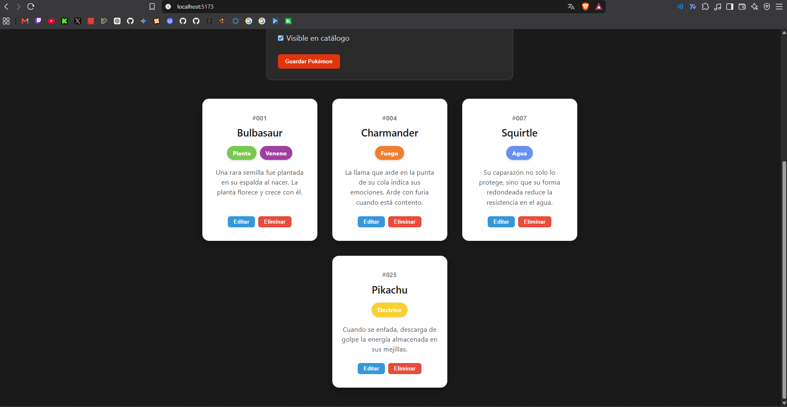
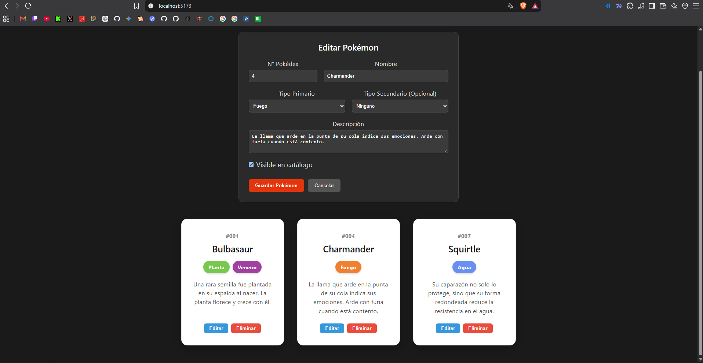
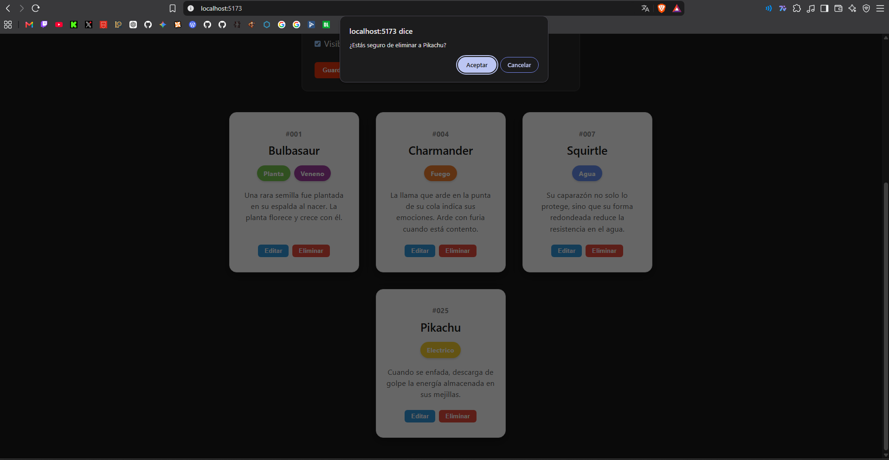

# PokéWiki Web — Laboratorio 8: Integración Full-Stack con CRUD Completo

Aplicación web interactiva Full-Stack desarrollada con **Django REST Framework** en el backend y **React (Vite)** en el frontend, permitiendo la gestión integral (Crear, Leer, Actualizar y Eliminar) del catálogo de Pokémon.

---

##  Arquitectura y Tecnologías

* **Backend:** Django 5.x + Django REST Framework (DRF) + `django-cors-headers`.
* **Frontend:** React 19 + Vite.
* **Base de Datos:** SQLite3 (Django ORM).
* **Comunicación:** API RESTful mediante peticiones HTTP asíncronas (`fetch`) canalizadas por el proxy de Vite (`/api/pokemon/`).

---

##  Endpoints de la API REST (`/api/pokemon/`)

| Método | Endpoint | Acción | Descripción |
| :--- | :--- | :--- | :--- |
| `GET` | `/api/pokemon/` | Listar | Retorna la lista completa de Pokémon registrados ordenados por número. |
| `POST` | `/api/pokemon/` | Crear | Registra un nuevo Pokémon con validación en servidor. |
| `GET` | `/api/pokemon/{id}/` | Detalle | Obtiene los detalles de un Pokémon por su ID. |
| `PUT` | `/api/pokemon/{id}/` | Actualizar | Sobrescribe y actualiza todos los datos del Pokémon. |
| `DELETE`| `/api/pokemon/{id}/` | Eliminar | Elimina el registro del Pokémon de la base de datos. |

---

##  Evidencias de Funcionamiento (CRUD)

### 1. Creación de un nuevo Pokémon (POST)
Operación para añadir una nueva criatura al catálogo mediante formulario con validación:


### 2. Edición de un Pokémon existente (PUT)
Carga de datos del registro en el formulario, modificación y actualización reactiva:


### 3. Eliminación de un registro (DELETE)
Confirmación en navegador y eliminación directa desde la base de datos:


---

##  Instrucciones de Ejecución Local

### 1. Servidor Backend (Django)
```powershell
cd backend
.venv\Scripts\Activate.ps1
python manage.py runserver